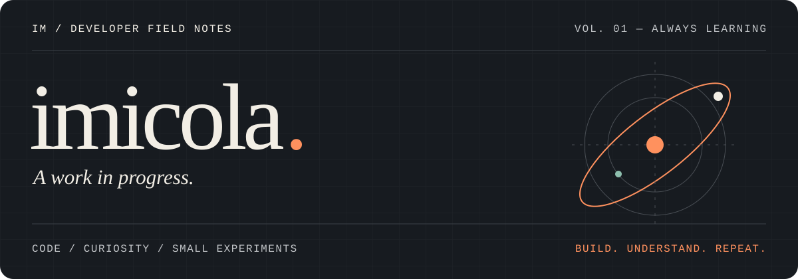

<p align="center">
  
</p>

<p align="center">
  <a href="https://github.com/imicola?tab=repositories">项目 / Projects</a> &nbsp;·&nbsp;
  <a href="https://github.com/imicola/Questions-and-Impressions">笔记 / Notes</a> &nbsp;·&nbsp;
  <a href="mailto:imicola@outlook.com">联系 / Say hello</a>
</p>

# 你好，我是 Imicola。

软件工程学生，写代码，也记录从「能运行」到「弄明白」的过程。

从 C++ 和算法题出发，慢慢走向 Go、后端开发与自己的小工具。这里放着我的练习、实验，以及一些想认真做好的东西。

> 把好奇心写成代码，把问题留给下一次迭代。

## 01 / 正在探索

- **Go 与后端开发** — 在实际项目里理解接口、数据与服务之间的关系。
- **C++ 与算法** — 保持解题，也把思路整理成可以回看的笔记。
- **工具与知识管理** — 尝试让记录、检索和日常使用变得更顺手。

## 02 / 项目切片

### [Notebit ↗](https://github.com/imicola/notebit)

本地优先的 Markdown 笔记应用，把写作、知识连接与 AI 检索放在一起。一次关于个人知识管理的工具实验。

`Go` `Wails` `React` `SQLite` · AI 辅助开发项目

### [Smart Study Room ↗](https://github.com/imicola/smart-study-room)

面向高校共享自习室的预约与管理平台。团队课程项目，参与用户与权限模块、总体架构和协作整合。

`Go` `Vue` `PostgreSQL` `Redis` · 团队课程设计

### [Questions & Impressions ↗](https://github.com/imicola/Questions-and-Impressions)

从一道题到一种思路。收录 C++、算法竞赛的习题与学习笔记，也是这个主页最初的起点。

`C++` `Algorithms` `Learning notes` · 原 LuoGutest

[查看其他仓库 →](https://github.com/imicola?tab=repositories)

## 03 / 常用工具

**写代码** &nbsp; Go · C++ · Python<br />
**做项目** &nbsp; Git · VS Code · Windows / WSL

### 也在这些地方解题

[Codeforces](https://codeforces.com/profile/imicola) &nbsp; / &nbsp;
[洛谷](https://www.luogu.com.cn/user/1422275) &nbsp; / &nbsp;
[牛客](https://ac.nowcoder.com/acm/contest/profile/693475085)

## 04 / 开发足迹

一些自动记录的日常切片，展开可以查看最近的编码统计。

<details>
<summary><b>打开开发日志 / WakaTime</b></summary>


<!--START_SECTION:waka-->


**🐱 My GitHub Data** 

> 📦 419.0 kB Used in GitHub's Storage 
 > 
> 🏆 196 Contributions in the Year 2026
 > 
> 🚫 Not Opted to Hire
 > 
> 📜 14 Public Repositories 
 > 
> 🔑 0 Private Repositories 
 > 
**I'm an Early 🐤** 

```text
🌞 Morning                236 commits         ██████░░░░░░░░░░░░░░░░░░░   23.91 % 
🌆 Daytime                395 commits         ██████████░░░░░░░░░░░░░░░   40.02 % 
🌃 Evening                325 commits         ████████░░░░░░░░░░░░░░░░░   32.93 % 
🌙 Night                  31 commits          █░░░░░░░░░░░░░░░░░░░░░░░░   03.14 % 
```
📅 **I'm Most Productive on Wednesday** 

```text
Monday                   127 commits         ███░░░░░░░░░░░░░░░░░░░░░░   12.87 % 
Tuesday                  171 commits         ████░░░░░░░░░░░░░░░░░░░░░   17.33 % 
Wednesday                405 commits         ██████████░░░░░░░░░░░░░░░   41.03 % 
Thursday                 59 commits          █░░░░░░░░░░░░░░░░░░░░░░░░   05.98 % 
Friday                   97 commits          ██░░░░░░░░░░░░░░░░░░░░░░░   09.83 % 
Saturday                 66 commits          ██░░░░░░░░░░░░░░░░░░░░░░░   06.69 % 
Sunday                   62 commits          ██░░░░░░░░░░░░░░░░░░░░░░░   06.28 % 
```


📊 **This Week I Spent My Time On** 

```text
🕑︎ Time Zone: Asia/Shanghai

💬 Programming Languages: 
Go                       5 hrs 19 mins       ██████████████░░░░░░░░░░░   57.69 % 
Markdown                 1 hr 31 mins        ████░░░░░░░░░░░░░░░░░░░░░   16.48 % 
Other                    1 hr 19 mins        ████░░░░░░░░░░░░░░░░░░░░░   14.29 % 
C++                      57 mins             ███░░░░░░░░░░░░░░░░░░░░░░   10.33 % 
JSON                     3 mins              ░░░░░░░░░░░░░░░░░░░░░░░░░   00.59 % 

🔥 Editors: 
VS Code                  6 hrs 58 mins       ███████████████████░░░░░░   75.61 % 
Codex Vscode             2 hrs 2 mins        ██████░░░░░░░░░░░░░░░░░░░   22.11 % 
Obsidian                 12 mins             █░░░░░░░░░░░░░░░░░░░░░░░░   02.27 % 

🐱‍💻 Projects: 
sentinel-go              5 hrs 42 mins       ███████████████░░░░░░░░░░   61.89 % 
Work                     1 hr 35 mins        ████░░░░░░░░░░░░░░░░░░░░░   17.31 % 
Questions-and-Impressions57 mins             ███░░░░░░░░░░░░░░░░░░░░░░   10.33 % 
e-eng-markdown-yyyy-mm-dd19 mins             █░░░░░░░░░░░░░░░░░░░░░░░░   03.56 % 
default                  13 mins             █░░░░░░░░░░░░░░░░░░░░░░░░   02.39 % 

💻 Operating System: 
Windows                  8 hrs 16 mins       ██████████████████████░░░   89.67 % 
WSL                      57 mins             ███░░░░░░░░░░░░░░░░░░░░░░   10.33 % 
```

🤖 **AI Coding This Week** 

```text
⏱ AI Coding Time: 3 hrs 32 mins (38.31%)

✍️ 606 lines written by AI, 860 lines written by hand (41.34% AI-written)

🔤 1,421,374 Input Tokens, 178,927 Output Tokens

💵 $57.54 Estimated AI Cost This Week

🧠 26 AI Sessions, 66 AI Prompts

GPT                      606 lines           █████████████████████████   100.00 % 
GLM                      0 lines             ░░░░░░░░░░░░░░░░░░░░░░░░░   00.00 % 
Codex-Vscode             0 lines             ░░░░░░░░░░░░░░░░░░░░░░░░░   00.00 % 

🔎 AI Coding Insights:
⚖️ Balanced with AI — 41.34% of written lines came from AI
📚 Verbose Prompter — average 6,009 characters per prompt
🔁 Iterative Prompter — average 3 prompts per session
🔍 Hands-On Reviewer — 68.05% of changed lines were hand-edited
```

**I Mostly Code in Go** 

```text
Go                       2 repos             ████░░░░░░░░░░░░░░░░░░░░░   15.38 % 
Vue                      1 repo              ██░░░░░░░░░░░░░░░░░░░░░░░   07.69 % 
Python                   1 repo              ██░░░░░░░░░░░░░░░░░░░░░░░   07.69 % 
C#                       1 repo              ██░░░░░░░░░░░░░░░░░░░░░░░   07.69 % 
Astro                    1 repo              ██░░░░░░░░░░░░░░░░░░░░░░░   07.69 % 
```


**Timeline**


 Last Updated on 25/09/2026 21:42:41 UTC
<!--END_SECTION:waka-->

</details>

---

<p align="center">
  <b>还在学习，也一直在动手。</b><br />
  <sub>Still learning. Still building.</sub>
</p>

<p align="center">
  <a href="mailto:imicola@outlook.com">imicola@outlook.com</a>
  &nbsp; / &nbsp;
  <a href="https://github.com/imicola">@imicola</a>
</p>
