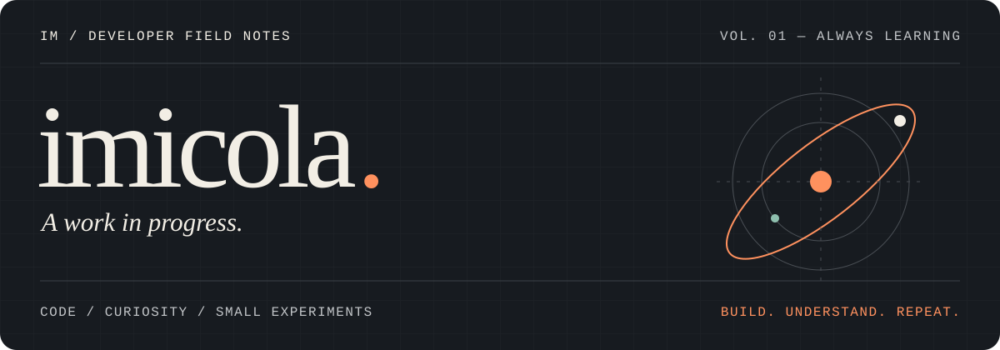

<p align="center">
  
</p>

<p align="center">
  <a href="https://github.com/imicola?tab=repositories">项目 / Projects</a> &nbsp;·&nbsp;
  <a href="https://github.com/imicola/Questions-and-Impressions">笔记 / Notes</a> &nbsp;·&nbsp;
  <a href="mailto:imicola@outlook.com">联系 / Say hello</a>
</p>

# 你好，我是 Imicola。

软件工程学生，写代码，也记录从「能运行」到「弄明白」的过程。

从 C++ 和算法题出发，慢慢走向 Go、后端开发与自己的小工具。这里放着我的练习、实验，以及一些想认真做好的东西。

> 把好奇心写成代码，把问题留给下一次迭代。

## 01 / 正在探索

- **Go 与后端开发** — 在实际项目里理解接口、数据与服务之间的关系。
- **C++ 与算法** — 保持解题，也把思路整理成可以回看的笔记。
- **工具与知识管理** — 尝试让记录、检索和日常使用变得更顺手。

## 02 / 项目切片

### [Notebit ↗](https://github.com/imicola/notebit)

本地优先的 Markdown 笔记应用，把写作、知识连接与 AI 检索放在一起。一次关于个人知识管理的工具实验。

`Go` `Wails` `React` `SQLite` · AI 辅助开发项目

### [Smart Study Room ↗](https://github.com/imicola/smart-study-room)

面向高校共享自习室的预约与管理平台。团队课程项目，参与用户与权限模块、总体架构和协作整合。

`Go` `Vue` `PostgreSQL` `Redis` · 团队课程设计

### [Questions & Impressions ↗](https://github.com/imicola/Questions-and-Impressions)

从一道题到一种思路。收录 C++、算法竞赛的习题与学习笔记，也是这个主页最初的起点。

`C++` `Algorithms` `Learning notes` · 原 LuoGutest

[查看其他仓库 →](https://github.com/imicola?tab=repositories)

## 03 / 常用工具

**写代码** &nbsp; Go · C++ · Python<br />
**做项目** &nbsp; Git · VS Code · Windows / WSL

### 也在这些地方解题

[Codeforces](https://codeforces.com/profile/imicola) &nbsp; / &nbsp;
[洛谷](https://www.luogu.com.cn/user/1422275) &nbsp; / &nbsp;
[牛客](https://ac.nowcoder.com/acm/contest/profile/693475085)

## 04 / 开发足迹

一些自动记录的日常切片，展开可以查看最近的编码统计。

<details>
<summary><b>打开开发日志 / WakaTime</b></summary>


<!--START_SECTION:waka-->


**🐱 My GitHub Data** 

> 📦 420.0 kB Used in GitHub's Storage 
 > 
> 🏆 196 Contributions in the Year 2026
 > 
> 🚫 Not Opted to Hire
 > 
> 📜 14 Public Repositories 
 > 
> 🔑 1 Private Repositories 
 > 
**I'm an Early 🐤** 

```text
🌞 Morning                236 commits         ██████░░░░░░░░░░░░░░░░░░░   23.89 % 
🌆 Daytime                395 commits         ██████████░░░░░░░░░░░░░░░   39.98 % 
🌃 Evening                325 commits         ████████░░░░░░░░░░░░░░░░░   32.89 % 
🌙 Night                  32 commits          █░░░░░░░░░░░░░░░░░░░░░░░░   03.24 % 
```
📅 **I'm Most Productive on Wednesday** 

```text
Monday                   128 commits         ███░░░░░░░░░░░░░░░░░░░░░░   12.96 % 
Tuesday                  171 commits         ████░░░░░░░░░░░░░░░░░░░░░   17.31 % 
Wednesday                405 commits         ██████████░░░░░░░░░░░░░░░   40.99 % 
Thursday                 59 commits          █░░░░░░░░░░░░░░░░░░░░░░░░   05.97 % 
Friday                   97 commits          ██░░░░░░░░░░░░░░░░░░░░░░░   09.82 % 
Saturday                 66 commits          ██░░░░░░░░░░░░░░░░░░░░░░░   06.68 % 
Sunday                   62 commits          ██░░░░░░░░░░░░░░░░░░░░░░░   06.28 % 
```


📊 **This Week I Spent My Time On** 

```text
🕑︎ Time Zone: Asia/Shanghai

💬 Programming Languages: 
Other                    11 hrs 8 mins       ██████████████░░░░░░░░░░░   54.88 % 
Markdown                 4 hrs 32 mins       ██████░░░░░░░░░░░░░░░░░░░   22.37 % 
Go                       2 hrs 39 mins       ███░░░░░░░░░░░░░░░░░░░░░░   13.07 % 
Python                   28 mins             █░░░░░░░░░░░░░░░░░░░░░░░░   02.36 % 
YAML                     20 mins             ░░░░░░░░░░░░░░░░░░░░░░░░░   01.69 % 

🔥 Editors: 
Obsidian                 13 hrs 44 mins      █████████████████░░░░░░░░   67.65 % 
VS Code                  3 hrs 49 mins       █████░░░░░░░░░░░░░░░░░░░░   18.84 % 
Codex Vscode             2 hrs 14 mins       ███░░░░░░░░░░░░░░░░░░░░░░   11.08 % 
Antigravity Desktop      29 mins             █░░░░░░░░░░░░░░░░░░░░░░░░   02.44 % 

🐱‍💻 Projects: 
OCR                      8 hrs 5 mins        ██████████░░░░░░░░░░░░░░░   39.85 % 
sentinel-go              2 hrs 50 mins       ███░░░░░░░░░░░░░░░░░░░░░░   13.96 % 
Grup Work                2 hrs 10 mins       ███░░░░░░░░░░░░░░░░░░░░░░   10.68 % 
Work                     1 hr 40 mins        ██░░░░░░░░░░░░░░░░░░░░░░░   08.25 % 
Project01                1 hr 15 mins        ██░░░░░░░░░░░░░░░░░░░░░░░   06.16 % 

💻 Operating System: 
Windows                  20 hrs 18 mins      █████████████████████████   100.00 % 
```

🤖 **AI Coding This Week** 

```text
⏱ AI Coding Time: 17 hrs 1 min (83.88%)

✍️ 5,271 lines written by AI, 522 lines written by hand (90.99% AI-written)

🔤 7,966,066 Input Tokens, 1,527,118 Output Tokens

💵 $615.88 Estimated AI Cost This Week

🧠 106 AI Sessions, 87 AI Prompts

ZCode                    3,989 lines         ███████████████████░░░░░░   75.00 % 
GPT                      1,330 lines         ██████░░░░░░░░░░░░░░░░░░░   25.00 % 
GLM                      0 lines             ░░░░░░░░░░░░░░░░░░░░░░░░░   00.00 % 
Codex-Vscode             0 lines             ░░░░░░░░░░░░░░░░░░░░░░░░░   00.00 % 
Gemini                   0 lines             ░░░░░░░░░░░░░░░░░░░░░░░░░   00.00 % 

🔎 AI Coding Insights:
🤖 AI-Driven — 90.99% of written lines came from AI
📚 Verbose Prompter — average 4,858 characters per prompt
🎯 One-Shot Prompter — average 1 prompts per session
🚀 High AI Trust — 13.19% of changed lines were hand-edited
```

**I Mostly Code in HTML** 

```text
HTML                     3 repos             █████░░░░░░░░░░░░░░░░░░░░   21.43 % 
Go                       2 repos             ████░░░░░░░░░░░░░░░░░░░░░   14.29 % 
Vue                      1 repo              ██░░░░░░░░░░░░░░░░░░░░░░░   07.14 % 
Python                   1 repo              ██░░░░░░░░░░░░░░░░░░░░░░░   07.14 % 
C#                       1 repo              ██░░░░░░░░░░░░░░░░░░░░░░░   07.14 % 
```


**Timeline**


 Last Updated on 30/09/2026 22:26:28 UTC
<!--END_SECTION:waka-->

</details>

---

<p align="center">
  <b>还在学习，也一直在动手。</b><br />
  <sub>Still learning. Still building.</sub>
</p>

<p align="center">
  <a href="mailto:imicola@outlook.com">imicola@outlook.com</a>
  &nbsp; / &nbsp;
  <a href="https://github.com/imicola">@imicola</a>
</p>
