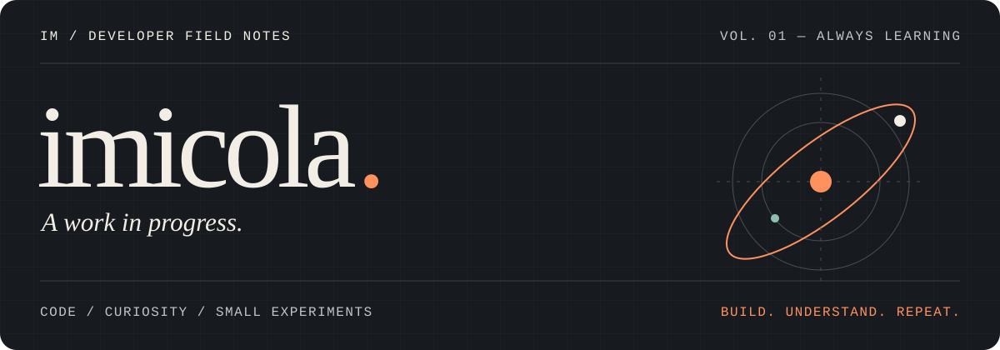
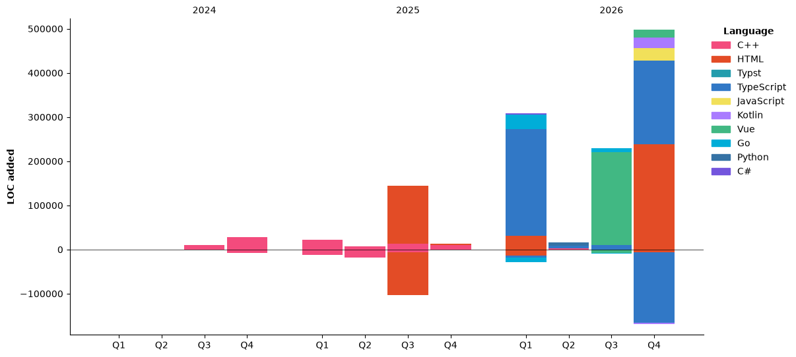

<p align="center">
  
</p>

<p align="center">
  <a href="https://github.com/imicola?tab=repositories">项目 / Projects</a> &nbsp;·&nbsp;
  <a href="https://github.com/imicola/Questions-and-Impressions">笔记 / Notes</a> &nbsp;·&nbsp;
  <a href="mailto:imicola@outlook.com">联系 / Say hello</a>
</p>

# 你好，我是 Imicola。

软件工程学生，写代码，也记录从「能运行」到「弄明白」的过程。

从 C++ 和算法题出发，慢慢走向 Go、后端开发与自己的小工具。这里放着我的练习、实验，以及一些想认真做好的东西。

> 把好奇心写成代码，把问题留给下一次迭代。

## 01 / 正在探索

- **Go 与后端开发** — 在实际项目里理解接口、数据与服务之间的关系。
- **C++ 与算法** — 保持解题，也把思路整理成可以回看的笔记。
- **工具与知识管理** — 尝试让记录、检索和日常使用变得更顺手。

## 02 / 项目切片

### [Notebit ↗](https://github.com/imicola/notebit)

本地优先的 Markdown 笔记应用，把写作、知识连接与 AI 检索放在一起。一次关于个人知识管理的工具实验。

`Go` `Wails` `React` `SQLite` · AI 辅助开发项目

### [Smart Study Room ↗](https://github.com/imicola/smart-study-room)

面向高校共享自习室的预约与管理平台。团队课程项目，参与用户与权限模块、总体架构和协作整合。

`Go` `Vue` `PostgreSQL` `Redis` · 团队课程设计

### [Questions & Impressions ↗](https://github.com/imicola/Questions-and-Impressions)

从一道题到一种思路。收录 C++、算法竞赛的习题与学习笔记，也是这个主页最初的起点。

`C++` `Algorithms` `Learning notes` · 原 LuoGutest

[查看其他仓库 →](https://github.com/imicola?tab=repositories)

## 03 / 常用工具

**写代码** &nbsp; Go · C++ · Python<br />
**做项目** &nbsp; Git · VS Code · Windows / WSL

### 也在这些地方解题

[Codeforces](https://codeforces.com/profile/imicola) &nbsp; / &nbsp;
[洛谷](https://www.luogu.com.cn/user/1422275) &nbsp; / &nbsp;
[牛客](https://ac.nowcoder.com/acm/contest/profile/693475085)

## 04 / 开发足迹

一些自动记录的日常切片，展开可以查看最近的编码统计。

<details>
<summary><b>打开开发日志 / WakaTime</b></summary>


<!--START_SECTION:waka-->


**🐱 My GitHub Data** 

> 📦 561.3 kB Used in GitHub's Storage 
 > 
> 🏆 289 Contributions in the Year 2026
 > 
> 🚫 Not Opted to Hire
 > 
> 📜 19 Public Repositories 
 > 
> 🔑 0 Private Repositories 
 > 
**I'm an Early 🐤** 

```text
🌞 Morning                243 commits         ██████░░░░░░░░░░░░░░░░░░░   22.03 % 
🌆 Daytime                429 commits         ██████████░░░░░░░░░░░░░░░   38.89 % 
🌃 Evening                385 commits         █████████░░░░░░░░░░░░░░░░   34.90 % 
🌙 Night                  46 commits          █░░░░░░░░░░░░░░░░░░░░░░░░   04.17 % 
```
📅 **I'm Most Productive on Wednesday** 

```text
Monday                   141 commits         ███░░░░░░░░░░░░░░░░░░░░░░   12.78 % 
Tuesday                  164 commits         ████░░░░░░░░░░░░░░░░░░░░░   14.87 % 
Wednesday                412 commits         █████████░░░░░░░░░░░░░░░░   37.35 % 
Thursday                 94 commits          ██░░░░░░░░░░░░░░░░░░░░░░░   08.52 % 
Friday                   116 commits         ███░░░░░░░░░░░░░░░░░░░░░░   10.52 % 
Saturday                 78 commits          ██░░░░░░░░░░░░░░░░░░░░░░░   07.07 % 
Sunday                   98 commits          ██░░░░░░░░░░░░░░░░░░░░░░░   08.88 % 
```


📊 **This Week I Spent My Time On** 

```text
🕑︎ Time Zone: Asia/Shanghai

💬 Programming Languages: 
Markdown                 14 hrs 22 mins      ██████████████████░░░░░░░   72.96 % 
Other                    1 hr 19 mins        ██░░░░░░░░░░░░░░░░░░░░░░░   06.70 % 
JavaScript               42 mins             █░░░░░░░░░░░░░░░░░░░░░░░░   03.57 % 
Python                   35 mins             █░░░░░░░░░░░░░░░░░░░░░░░░   03.00 % 
CSS                      31 mins             █░░░░░░░░░░░░░░░░░░░░░░░░   02.66 % 

🔥 Editors: 
Obsidian                 15 hrs 21 mins      ███████████████████░░░░░░   77.92 % 
Zed                      2 hrs 33 mins       ███░░░░░░░░░░░░░░░░░░░░░░   12.98 % 
Codex Vscode             1 hr 47 mins        ██░░░░░░░░░░░░░░░░░░░░░░░   09.10 % 

🐱‍💻 Projects: 
个人图书馆                    12 hrs 12 mins      ████████████████░░░░░░░░░   62.01 % 
Work                     2 hrs 25 mins       ███░░░░░░░░░░░░░░░░░░░░░░   12.35 % 
AI Knowledge Base        2 hrs 16 mins       ███░░░░░░░░░░░░░░░░░░░░░░   11.56 % 
fable5                   52 mins             █░░░░░░░░░░░░░░░░░░░░░░░░   04.42 % 
sentinel-go              51 mins             █░░░░░░░░░░░░░░░░░░░░░░░░   04.35 % 

💻 Operating System: 
Windows                  19 hrs 42 mins      █████████████████████████   100.00 % 
```

🤖 **AI Coding This Week** 

```text
⏱ AI Coding Time: 9 hrs 1 min (45.81%)

✍️ 4,965 lines written by AI, 338 lines written by hand (93.63% AI-written)

🔤 4,269,538 Input Tokens, 588,274 Output Tokens

💵 $146.49 Estimated AI Cost This Week

🧠 36 AI Sessions, 198 AI Prompts

GPT                      3,803 lines         ███████████████████░░░░░░   74.29 % 
GLM                      1,316 lines         ██████░░░░░░░░░░░░░░░░░░░   25.71 % 
Gemini                   0 lines             ░░░░░░░░░░░░░░░░░░░░░░░░░   00.00 % 
Opus                     0 lines             ░░░░░░░░░░░░░░░░░░░░░░░░░   00.00 % 
Codex-Vscode             0 lines             ░░░░░░░░░░░░░░░░░░░░░░░░░   00.00 % 

🔎 AI Coding Insights:
🤖 AI-Driven — 93.63% of written lines came from AI
📚 Verbose Prompter — average 4,973 characters per prompt
🔁 Iterative Prompter — average 6 prompts per session
🚀 High AI Trust — 6.43% of changed lines were hand-edited
```

**I Mostly Code in TypeScript** 

```text
TypeScript               5 repos             ██████░░░░░░░░░░░░░░░░░░░   22.73 % 
Go                       3 repos             ███░░░░░░░░░░░░░░░░░░░░░░   13.64 % 
Vue                      2 repos             ██░░░░░░░░░░░░░░░░░░░░░░░   09.09 % 
Rust                     1 repo              █░░░░░░░░░░░░░░░░░░░░░░░░   04.55 % 
Python                   1 repo              █░░░░░░░░░░░░░░░░░░░░░░░░   04.55 % 
```


**Timeline**




 Last Updated on 12/11/2026 23:46:05 UTC
<!--END_SECTION:waka-->

</details>

---

<p align="center">
  <b>还在学习，也一直在动手。</b><br />
  <sub>Still learning. Still building.</sub>
</p>

<p align="center">
  <a href="mailto:imicola@outlook.com">imicola@outlook.com</a>
  &nbsp; / &nbsp;
  <a href="https://github.com/imicola">@imicola</a>
</p>
